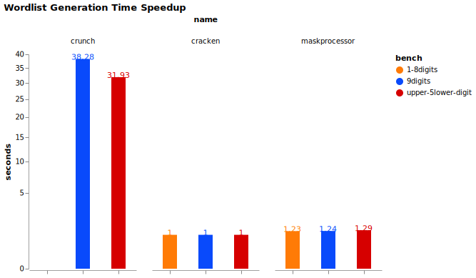

# Cracken
[](https://crates.io/crates/cracken)
[](https://crates.io/crates/cracken)
[](https://docs.rs/cracken)
[](https://crates.io/crates/cracken)

Cracken is a fast password wordlist generator written in pure safe Rust. Inspired by great tools like [maskprocessor][mp] and [Crunch][crunch].


## Getting Started

**download (linux only):** [latest release 🔗][releases]

*for more installation options see `installation` section*

**run Cracken:**

generate all words of length 8 starting with uppercase followed by 6 lowercase chars and then a digit:

```bash
$ ./cracken -o pwdz.lst '?u?l?l?l?l?l?l?d'
```

generate words from two wordlists with year suffix (1000-2999) `<firstname><lastname><year>`

```bash
$ ./cracken --wordlist firstnames.txt --wordlist lastnames.lst --charset '12' '?w1?w2?1?d?d?d'
```


## Performance

As of writing this, Cracken is probably the world's fastest wordlist generator:



Cracken has around 30% increased performance over hashcat's fast [maskprocessor][mp] thats written in C.

Cracken can generate around 2 GB/s per core.

more details on [benchmarks/ 🔗](./benchmarks/README.md)

Why speed is important? A typical GPU can test billions passwords per second depending on the password hash function.
When the wordlist generator produces fewer words per second than the cracking tool can handle - the cracking speed will degrade.


## Features

* [x] super fast wordlist generator
* [x] fully compatible with maskprocessor mask syntax
* [x] wordlists as input
* [x] custom charsets
* [x] fixed chars at any position
* [x] min/max word lengths
* [x] combinations - calculates number of total passwords from the mask


## Installation

install Cracken or compile from source


### Download Binary (Linux Only)

download latest release from [releases 🔗][releases]

### Build From Source (All Platforms)

Cracken is written in Rust and needs rustc to get compiled. Cracken should support all Platforms that Rust support.

installation instructions for [cargo 🔗][rustc-installation]

there are two options building from source - installing with cargo from crates.io (preferred) or compiling manually from source.


#### 1. install from crates.io (preferred)

**install with cargo:**

```bash
$ cargo install cracken
```

#### 2. build from source


**clone Cracken:**

```bash
$ git clone https://github.com/shmuelamar/cracken
```

**build Cracken:**

```bash
$ cd cracken
$ cargo build --release
```

**run it:**

```bash
$ ./target/release/cracken --help
```


## Usage Info


```
$ cracken --help
Cracken v0.1.4 - a fast password wordlist generator 

USAGE:
    cracken [FLAGS] [OPTIONS] <mask>

FLAGS:
    -h, --help       
            Prints help information

    -s, --stats      
            prints the number of words this command will generate and exits

    -V, --version    
            Prints version information


OPTIONS:
    -c, --custom-charset <custom-charset>...    
            custom charset (string of chars). up to 9 custom charsets - ?1 to ?9. use ?1 on the mask for the first charset

    -x, --maxlen <max-length>                   
            maximum length of the mask to start from

    -m, --minlen <min-length>                   
            minimum length of the mask to start from

    -o, --output-file <output-file>             
            output file to write the wordlist to, defaults to stdout

    -w, --wordlist <wordlist>...                
            filename containing newline (0xA) separated words. note: currently all wordlists loaded to memory


ARGS:
    <mask>    
            the wordlist mask to generate.
            available masks are:
                builtin charsets:
                ?d - digits: "0123456789"
                ?l - lowercase: "abcdefghijklmnopqrstuvwxyz"
                ?u - uppercase: "ABCDEFGHIJKLMNOPQRSTUVWXYZ"
                ?s - symbols: " !\"\#$%&'()*+,-./:;<=>?@[\\]^_`{|}~"
                ?a - all characters: "?d?l?u?s"
                ?b - all binary values: (0-255)
            
                custom charsets ?1 to ?9:
                ?1 - first custom charset specified by --charset 'mychars'
            
                wordlists ?w1 to ?w9:
                ?w1 - first wordlist specified by --wordlist 'my-wordlist.txt'

Example Usage:

  # all digits from 00000000 to 99999999
  cracken ?d?d?d?d?d?d?d?d

  # all digits from 0 to 99999999
  cracken -m 1 ?d?d?d?d?d?d?d?d

  # words with pwd prefix - pwd0000 to pwd9999
  cracken pwd?d?d?d?d

  # all passwords of length 8 starting with upper then 6 lowers then digit
  cracken ?u?l?l?l?l?l?l?d

  # same as above, write output to pwds.txt instead of stdout
  cracken -o pwds.txt ?u?l?l?l?l?l?l?d

  # custom charset - all hex values
  cracken -c "0123456789abcdef" "?1?1?1?1"

  # 4 custom charsets - the order determines the id of the charset
  cracken -c "01" -c="ab" -c="de" -c="ef" "?1?2?3?4"

  # 4 lowercase chars with years 2000-2019 suffix
  cracken -c "01" "?l?l?l?l20?1?d"

  # starts with firstname from wordlist followed by 4 digits
  cracken -w "firstnames.txt" "?w1?d?d?d?d"

  # starts with firstname from wordlist with lastname from wordlist ending with symbol
  cracken -w "firstnames.txt" -w "lastnames.txt" -c "!@#$" "?w1?w2?1"

  # repeating wordlists multiple times and combining charsets
  cracken -w "verbs.txt" -w "nouns.txt" "?w1?w2?w1?w2?w2?d?d?d"

cracken-v0.1.4 linux-x86_64 compiler: rustc 1.35.0 (3c235d560 2019-05-20)
more info at: https://github.com/shmuelamar/cracken
```


## License

Cracken is licensed under MIT. **THIS PROJECT SHOULD BE USED FOR LEGAL PURPOSES ONLY**


## Contributing

Cracken is under active development, if you wish to help below is this the partial roadmap for this project.
Feel free to submit PRs and open issues.

### Features List

* [ ] input file of list of masks
* [ ] stderr status tracker thread
* [ ] wordlists load modes (currently all in memory) - add from disk / mmap
* [ ] multithreading
* [ ] compression


[mp]: https://hashcat.net/wiki/doku.php?id=maskprocessor
[crunch]: https://github.com/crunchsec/crunch
[releases]: https://github.com/shmuelamar/cracken/releases
[rustc-installation]: https://www.rust-lang.org/tools/install
